# Практическая работа 3 — отчет (Postman)

Цель:

1. Протестировать API из Практической работы 2 с помощью Postman (не менее 3 запросов).
2. Выбрать внешнее API, получить ключ, выполнить не менее 5 запросов.

## 1) Тестирование API из Практики 2

Проверяемое API: `practice-02-products-api/`

Как запустить сервер:

1. `cd practice-02-products-api`
2. `npm install`
3. `npm start`
4. База URL: `http://localhost:3000`

Эндпоинты, которые можно показать в отчете:

- `GET /products`
- `POST /products`
- `GET /products/:id`
- `PUT /products/:id`
- `DELETE /products/:id`

Postman:

- Импортируйте коллекцию: `practice-03-products-api-report/assets/requests/practice-02-products-api.postman_collection.json`
- В коллекции используется переменная `apiBase` (по умолчанию `http://localhost:3000`).

### Скриншоты (Практика 2)

1. `GET /` (health)

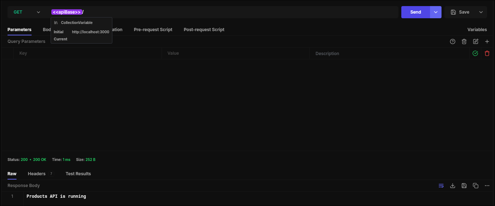

2. `GET /products`
   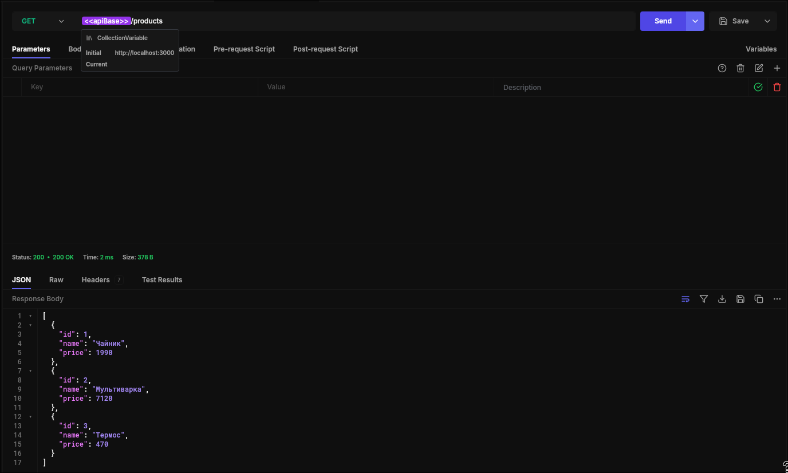

3. `POST /products`

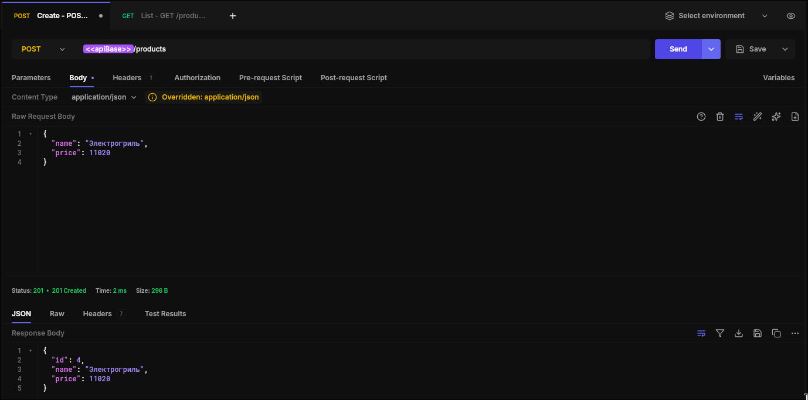

4. `GET /products/4`

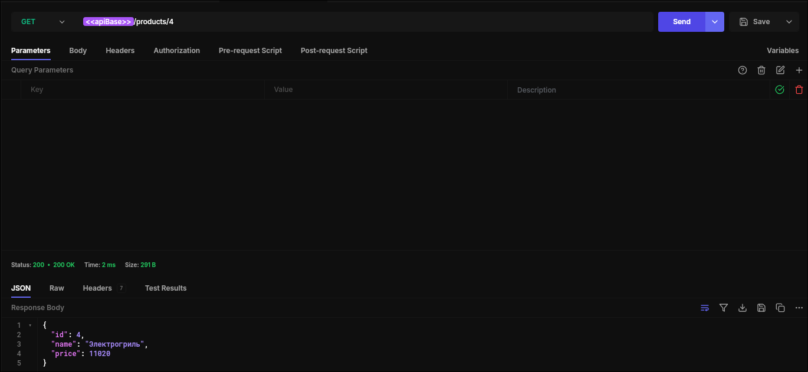

5. `PUT /products/4`

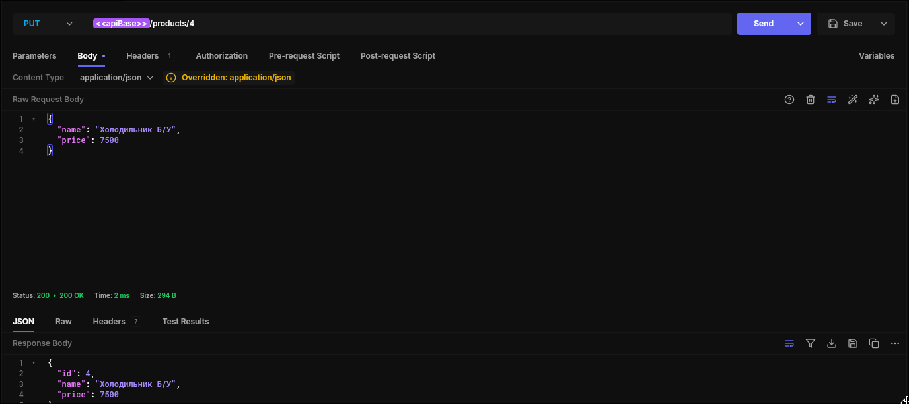

6. `DELETE /products/4`

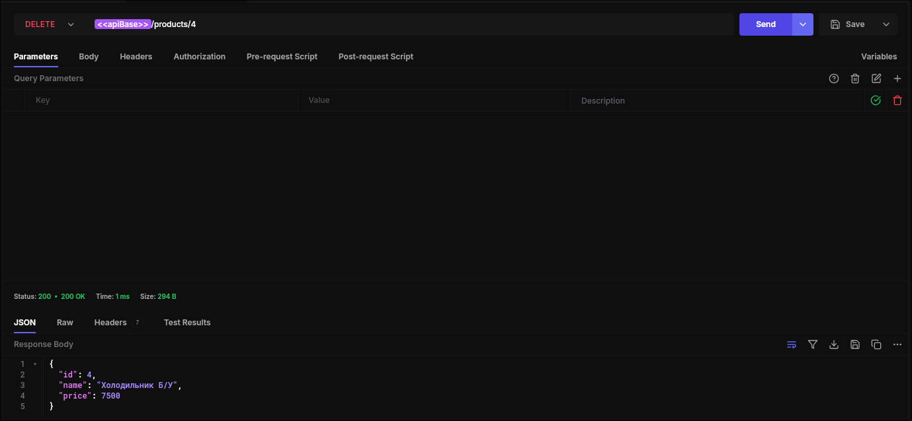

## 2) Внешнее API (OpenWeatherMap)

Выбранное API: OpenWeatherMap (`https://openweathermap.org/api`)

Ключ:

- Зарегистрируйтесь в OpenWeatherMap, получите API key и добавьте его в Postman как переменную `owmApiKey`.

Postman:

- Импортируйте коллекцию: `practice-03-products-api-report/assets/requests/openweathermap-api.postman_collection.json`
- В коллекции используются переменные:
  - `owmBase` (по умолчанию `https://api.openweathermap.org`)
  - `owmApiKey` (ваш ключ)

### Скриншоты (OpenWeatherMap)

1. Current weather (город)

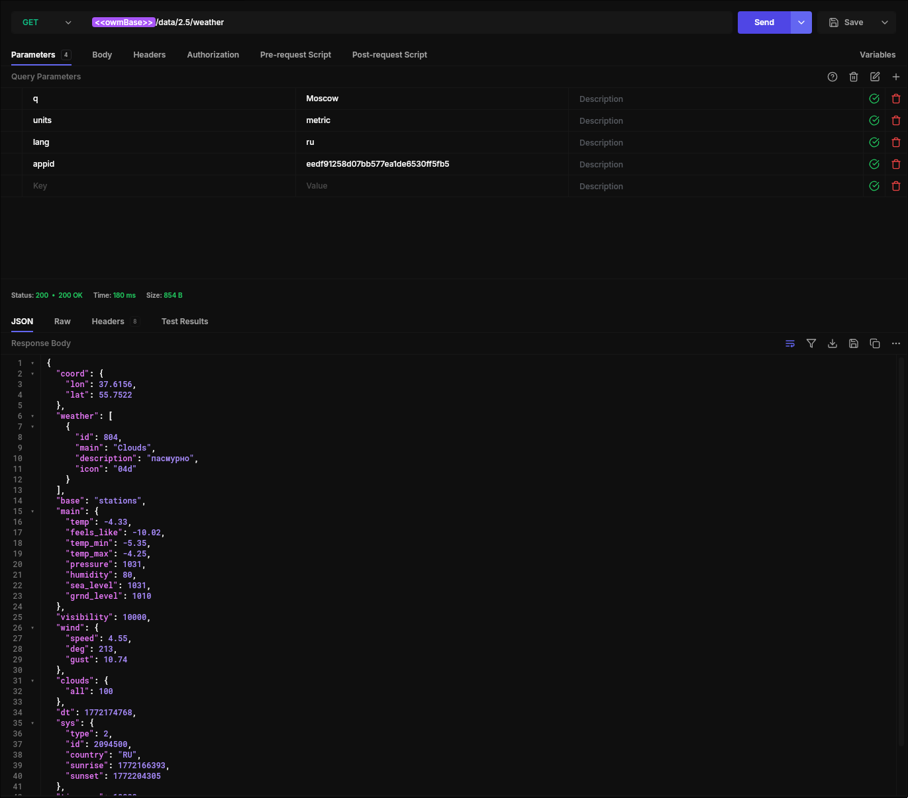

2. Current weather (координаты)

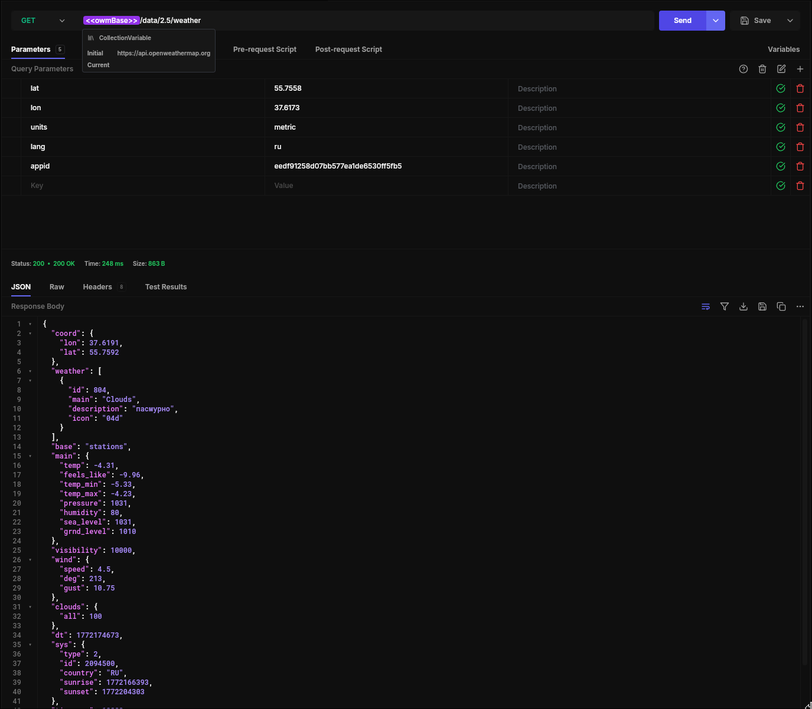

3. Forecast

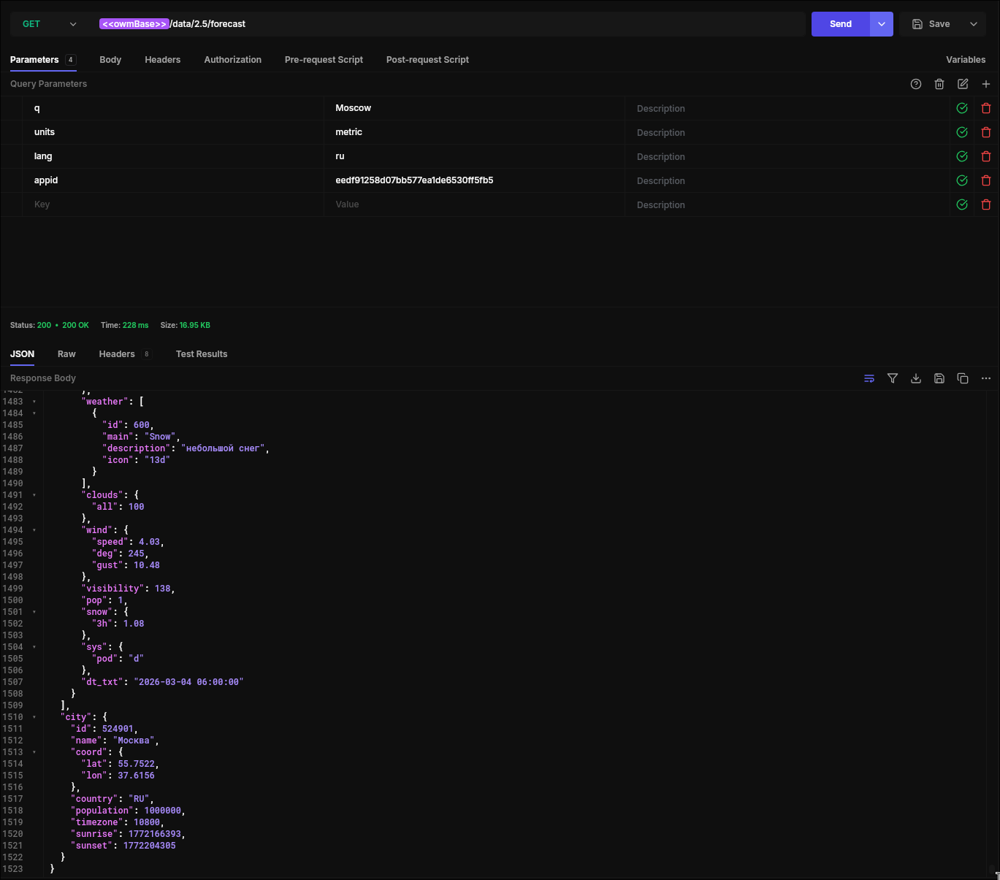

4. Air pollution

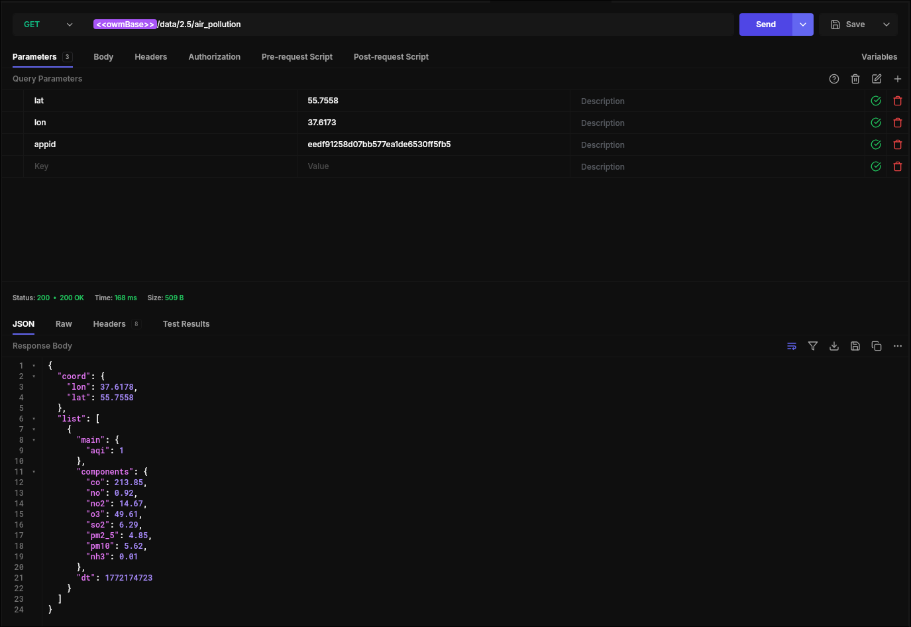

5. Geocoding (direct)

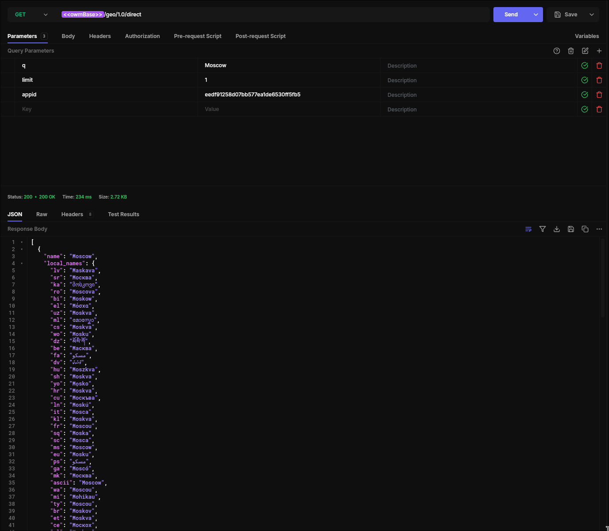
